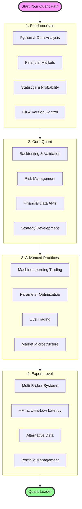

> 🇪🇸 [Leer en Español](ROADMAP.es.md) | 🇺🇸 **English**

# Quant Trading Learning Roadmap 2025

## Interactive Quantitative Trading Path

## Current Status (Completed)

### **Complete Documentation**
- **60+ documentation files** organized by category
- **Step-by-step guides** from beginner to advanced
- **Structured learning paths** by level
- **Cross-references** between theory and practice

### **Implemented Code Base**
- **Technical Indicators**: Moving Averages, VWAP with bands
- **Gap & Go Strategy**: Complete implementation with volume filters
- **Backtesting Engine**: Modular system with advanced metrics
- **Position Sizing**: Multiple models (Kelly, ATR, Fixed %)
- **Data Management**: Simulated APIs and centralized management
- **Complete Example**: Integration of all components

### **Base Infrastructure**
- **Modular Architecture**: Independent and reusable components
- **Technical Documentation**: READMEs and usage examples
- **GitHub Pages**: Website with navigable documentation

## Trading Strategies to Implement

### Core Strategies
- **Gap & Go with Dynamic Trailing Stop** - *Partially Implemented*
  - Basic implementation with volume and gap filters
  - ATR-based adaptive stop loss (in progress)
  - Automatic adjustment based on intraday volatility
  - Machine learning for trailing parameter optimization

- **VWAP Bounce + Reclaim with Rising Volume** - *Base Implemented*
  - VWAP and bands calculation implemented
  - Basic price vs VWAP signals
  - VWAP rejection and reclaim detector
  - Real-time relative volume analysis
  - Confirmation with tape divergences

- **Opening Range Breakout (ORB) Adapted for Small Caps**
  - 5, 15, and 30 minute ORB with volume filters
  - False breakout detector using order flow
  - Dynamic range adjustment based on pre-market volatility

### Advanced Strategies
- **Mean Reversion with RSI < 20 + News Analysis**
  - Integration with real-time news APIs
  - NLP for determining sentiment and relevance
  - Entry timing based on exhaustion patterns

- **Short Squeeze Detector**
  - Low float + unusual volume analysis
  - Real-time short interest monitoring
  - Parabolic movement prediction with ML

- **Multi-Day Runners with ABCD Pattern**
  - Automatic harmonic pattern identification
  - Continuation vs reversal analysis
  - Specific risk management for swings

### Machine Learning Strategies
- **Setup Classification with Random Forest / XGBoost**
  - Automatic feature engineering from raw data
  - Temporal cross-validation (walk-forward)
  - Model ensemble for greater robustness

- **Real-Time NLP**
  - Reddit sentiment analysis (WSB, pennystocks)
  - Twitter/X sentiment with influencer filters
  - Sentiment-price correlation for timing

## Quantitative Experiments

### Optimization and AutoML
- **Automatic Parameter Optimization**
  - Optuna implementation for hyperparameter tuning
  - Grid search vs Random search vs Bayesian optimization
  - Parallel backtesting in cloud

- **Automatic Feature Engineering**
  - Technical feature generation (100+ indicators)
  - Microstructure features (bid-ask spread, imbalance)
  - Automatic selection with importance scores

### Reinforcement Learning
- **Dynamic Position Management**
  - RL agent for sizing and scaling in/out
  - Custom environment with real costs
  - Transfer learning between similar strategies

- **Algorithmic Market Making**
  - Deep Q-Learning for small cap liquidity provision
  - Adverse selection simulation
  - Integrated risk controls

### Robustness and Validation
- **Adversarial Backtesting**
  - Synthetic data generation with extreme conditions
  - Stress testing with black swan scenarios
  - Monte Carlo for confidence intervals

- **Auto-Tagging of Operations**
  - Automatic labels: "late entry", "chase", "ideal", "FOMO"
  - Post-trade analysis for execution improvement
  - Dashboard of recurring error patterns

## Infrastructure and Development

### Core Architecture
- **Intelligent Scheduler**
  - Multi-bot orchestration with priorities
  - Auto-scaling based on market conditions
  - Automatic failover and redundancy

- **REST API for Signals**
  - Endpoints for receiving strategy alerts
  - Webhooks for TradingView integration
  - Rate limiting and JWT authentication

- **"Sentinel" Monitoring System**
  - Anomaly detection in bot behavior
  - Automatic alerts via Telegram/Discord
  - Automatic kill switch on excessive drawdown

### Data and Storage
- **Centralized Database**
  - MongoDB for unstructured data (news, social)
  - PostgreSQL + TimescaleDB for time series
  - Redis for caching and queues

- **Robust Data Pipeline**
  - Apache Kafka for data streaming
  - Automatic data validation and cleaning
  - Incremental backup to S3

### Cloud and Deployment
- **Serverless Infrastructure**
  - AWS Lambda for event-driven strategies
  - Step Functions for complex workflows
  - EventBridge for scheduling

- **Containerization and Orchestration**
  - Docker for each strategy
  - Kubernetes for horizontal scaling
  - Helm charts for deployment templates

## Visualization and Analytics

### Interactive Dashboards
- **Performance Heatmap**
  - Visualization by strategy, timeframe, and symbol
  - Drill-down to individual trades
  - Benchmark comparison

- **Equity Curve Analysis**
  - Multi-strategy comparison
  - Market regime detection
  - Interactive drawdown analysis

- **TreeMap of Profitable Setups**
  - Grouped by time of day, day of week
  - Size by profit, color by win rate
  - Dynamic filters by period

### Advanced Analytics
- **Automated Trade Review with AI**
  - GPT-4 generated annotations
  - Screenshots with technical analysis overlay
  - Personalized improvement suggestions

- **Performance Attribution**
  - P&L decomposition by factor
  - Timing vs selection analysis
  - Benchmarking against similar strategies

## Advanced and Experimental Features

### Simulation and Testing
- **Ultra-Realistic Market Simulator**
  - Agent-based microstructure modeling
  - Simulation of halts, SSR, and circuit breakers
  - Realistic market impact for large size

- **Advanced Paper Trading**
  - Simulated execution with real slippage
  - Partial fill modeling
  - Variable latency based on conditions

### Integrations
- **Multi-Broker Support**
  - IBKR for stocks and options
  - Alpaca for crypto and extended hours
  - DAS Trader for professional day trading
  - TD Ameritrade/Schwab API

- **Trading Platforms**
  - TradingView webhook integration
  - MetaTrader 5 for forex
  - NinjaTrader for futures
  - cTrader for ECN access

### Community and Gamification
- **Community Voting System**
  - Users vote on the next strategy to implement
  - Contributor leaderboard
  - Badges for performance and participation

- **Quantitative Coach with AI**
  - Automatic 1-10 evaluation per trade
  - Consistency analysis with the plan
  - Personalized improvement recommendations

## Educational Content and Documentation

### Fundamental Guides
- **Quantitative Trading 101**
  - Difference between backtesting, paper trading, and forward testing
  - How to avoid overfitting: techniques and examples
  - Walk-forward analysis explained

- **Detailed Comparisons**
  - IBKR vs Alpaca vs DAS: pros, cons, costs
  - Python vs JavaScript vs C++ for HFT
  - Cloud providers: AWS vs GCP vs Azure for trading

### Technical Tutorials
- **Complete Setup by Operating System**
  - Windows: WSL2 + Docker Desktop
  - macOS: Homebrew + native development
  - Linux: Kernel optimizations for low latency

- **Advanced Indicators Explained**
  - CVD (Cumulative Volume Delta): construction and usage
  - Order Flow Imbalance: aggressor detection
  - Footprint charts: professional reading

### Small Caps Mastery
- **Complete Glossary of Terms**
  - SSR, circuit breakers, T+2 settlement
  - Float rotation, squeeze mechanics
  - Dark pools and hidden liquidity

- **Level 2 and Tape Reading**
  - Spoofing and layering identification
  - Reading large prints
  - Accumulation/distribution detection

### Psychology and Continuous Improvement
- **Psychology of Algorithmic Trading**
  - How to handle system drawdowns
  - When to intervene manually
  - Trust in the quantitative process

- **Post-Mortem Framework**
  - Template for analyzing each operation
  - Key metrics to track
  - Iterative improvement process

### DevOps for Trading
- **Professional Monitoring**
  - Prometheus + Grafana setup
  - Intelligent alerts with PagerDuty
  - Structured logging with ELK stack

- **Automation and CI/CD**
  - GitHub Actions for automatic backtesting
  - Secure strategy deployment
  - Automatic rollback in case of losses

## Immediate Priorities (Next 4-6 weeks)

### **Indicator Expansion**
- [ ] **Bollinger Bands**: Complete implementation with signals
- [ ] **RSI**: Divergences and overbought/oversold levels  
- [ ] **MACD**: Crosses and histogram
- [ ] **Volume Profile**: POC and VAH/VAL analysis

### **New Strategies**
- [ ] **VWAP Reclaim**: Complete implementation
- [ ] **Opening Range Breakout**: 5/15/30 min ORB
- [ ] **Mean Reversion**: RSI oversold + volume confirmation
- [ ] **Low Float Runners**: Automatic detection

### **Backtesting Improvements**
- [ ] **Walk-Forward Analysis**: Temporal validation
- [ ] **Monte Carlo**: Robustness simulations
- [ ] **Advanced Metrics**: Calmar ratio, Sortino ratio
- [ ] **HTML Report**: Automatic visualizations

### **Real APIs**
- [ ] **Yahoo Finance**: yfinance integration
- [ ] **Alpha Vantage**: API key management
- [ ] **IEX Cloud**: Intraday data
- [ ] **Polygon.io**: High-quality data

## Long-Term Roadmap

### Q1 2025
- [x] ~~Implement basic Gap & Go~~ Completed
- [x] ~~Initial infrastructure setup~~ Completed  
- [x] ~~First version of backtesting engine~~ Completed
- [ ] Indicator and strategy expansion
- [ ] Real APIs and improved data management
- [ ] Basic web interface for visualization

### Q2 2025
- [ ] ML pipeline for setup classification
- [ ] Functional REST API
- [ ] Interactive dashboard with Streamlit/Dash
- [ ] Real-time alert system
- [ ] Automated paper trading

### Q3 2025
- [ ] Multi-broker integration (IBKR, Alpaca)
- [ ] Robust paper trading system
- [ ] First RL strategies
- [ ] Automatic parameter optimization
- [ ] Portfolio risk analysis

### Q4 2025
- [ ] Community platform launch
- [ ] Production deployment (cloud)
- [ ] Live trading with real capital
- [ ] Complete documentation and tutorials
- [ ] Subscription and signals system

## How to Contribute

### **For Developers**
1. **Fork** the repository
2. **Implement** a new strategy or indicator in `src/`
3. **Add documentation** in `docs/`
4. **Include examples** and tests
5. **Open a Pull Request** with detailed description

### **For Educators**
1. **Improve existing documentation** in `docs/`
2. **Create step-by-step tutorials**
3. **Add real case studies**
4. **Translate content** to other languages

### **For Researchers**
1. **Implement strategies** from academic papers
2. **Add advanced evaluation metrics**
3. **Validate results** with historical data
4. **Document findings** in reproducible format

### **Areas That Need Attention**
- [ ] **Testing**: Unit tests for all modules
- [ ] **Performance**: Backtesting optimization
- [ ] **Documentation**: More practical examples
- [ ] **Validation**: Comparison with known benchmarks
- [ ] **Integration**: Real broker APIs

## Progress Metrics

### **Current Project Status**
- **Documentation**: 60+ files
- **Code Base**: 7 main modules
- **Strategies**: 1 implemented, 5+ documented
- **Indicators**: 2 implemented, 8+ documented
- **Tests**: 0% coverage
- **Real APIs**: 0% implemented

### **Q1 2025 Goals**
- **Strategies**: 5 implemented
- **Indicators**: 8 implemented
- **Tests**: 80% coverage
- **Real APIs**: 3 providers
- **Users**: 100+ GitHub stars

---

*This roadmap is a living document and will be updated based on community feedback and project priorities.*

**Contact**: For suggestions or collaborations, open an issue on GitHub or contact the team.

**Your contribution makes a difference!** Every line of code, every documentation improvement, every reported bug helps build the best open-source quantitative trading platform.
