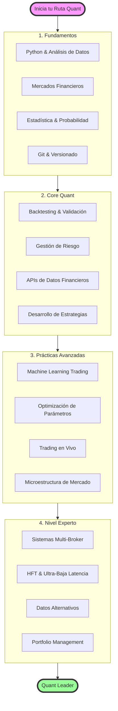

# Roadmap de Aprendizaje Quant Trading 2025

## 🗺️ Ruta Interactiva de Trading Cuantitativo

## ✅ Estado Actual (Completado)

### 📚 **Documentación Completa**
- ✅ **60+ archivos de documentación** organizados por categorías
- ✅ **Guías paso a paso** desde principiante hasta avanzado
- ✅ **Rutas de aprendizaje** estructuradas por nivel
- ✅ **Referencias cruzadas** entre teoría y práctica

### 💻 **Código Base Implementado**
- ✅ **Indicadores Técnicos**: Moving Averages, VWAP con bandas
- ✅ **Estrategia Gap & Go**: Implementación completa con filtros de volumen
- ✅ **Motor de Backtesting**: Sistema modular con métricas avanzadas
- ✅ **Position Sizing**: Múltiples modelos (Kelly, ATR, Fixed %)
- ✅ **Gestión de Datos**: APIs simuladas y gestión centralizada
- ✅ **Ejemplo Completo**: Integración de todos los componentes

### 🏗️ **Infraestructura Base**
- ✅ **Arquitectura Modular**: Componentes independientes y reutilizables
- ✅ **Documentación Técnica**: READMEs y ejemplos de uso
- ✅ **GitHub Pages**: Sitio web con documentación navegable

## 📊 Estrategias de Trading para Implementar

### 🎯 Estrategias Core
- **Gap & Go con Trailing Stop Dinámico** ⚡ *Parcialmente Implementado*
  - ✅ Implementación básica con filtros de volumen y gaps
  - 🔄 Stop loss adaptativo basado en ATR (en progreso)
  - 📋 Ajuste automático según volatilidad intradiaria
  - 📋 Machine learning para optimizar parámetros de trailing

- **VWAP Bounce + Reclaim con Volumen Creciente** ⚡ *Base Implementada*
  - ✅ Cálculo de VWAP y bandas implementado
  - ✅ Señales básicas precio vs VWAP
  - 📋 Detector de rechazo y reclaim del VWAP
  - 📋 Análisis de volumen relativo en tiempo real
  - 📋 Confirmación con divergencias en el tape

- **Opening Range Breakout (ORB) Adaptado a Small Caps**
  - ORB de 5, 15 y 30 minutos con filtros de volumen
  - Detector de falsos breakouts usando order flow
  - Ajuste dinámico del rango según la volatilidad pre-market

### 🔥 Estrategias Avanzadas
- **Mean Reversion con RSI < 20 + Análisis de Noticias**
  - Integración con APIs de noticias en tiempo real
  - NLP para determinar sentimiento y relevancia
  - Entry timing basado en exhaustion patterns

- **Short Squeeze Detector**
  - Análisis de float bajo + volumen inusual
  - Monitoreo de short interest en tiempo real
  - Predicción de movimientos parabólicos con ML

- **Multi-Day Runners con Patrón ABCD**
  - Identificación automática de patrones armónicos
  - Análisis de continuación vs reversión
  - Risk management específico para swings

### 🤖 Estrategias con Machine Learning
- **Clasificación de Setups con Random Forest / XGBoost**
  - Feature engineering automático desde raw data
  - Validación cruzada temporal (walk-forward)
  - Ensemble de modelos para mayor robustez

- **NLP en Tiempo Real**
  - Análisis de sentimiento de Reddit (WSB, pennystocks)
  - Twitter/X sentiment con filtros de influencers
  - Correlación sentimiento-precio para timing

## 🔬 Experimentos Cuantitativos

### 📈 Optimización y AutoML
- **Optimización Automática de Parámetros**
  - Implementación de Optuna para hyperparameter tuning
  - Grid search vs Random search vs Bayesian optimization
  - Backtesting paralelo en cloud

- **Feature Engineering Automático**
  - Generación de features técnicos (100+ indicadores)
  - Features de microestructura (bid-ask spread, imbalance)
  - Selección automática con importance scores

### 🎮 Reinforcement Learning
- **Gestión Dinámica de Posición**
  - RL agent para sizing y scaling in/out
  - Environment personalizado con costos reales
  - Transfer learning entre estrategias similares

- **Market Making Algorítmico**
  - Deep Q-Learning para small cap liquidity provision
  - Simulación de adverse selection
  - Risk controls integrados

### 🛡️ Robustez y Validación
- **Backtesting Adversarial**
  - Generación de data sintética con condiciones extremas
  - Stress testing con scenarios de black swan
  - Monte Carlo para confidence intervals

- **Auto-Tagging de Operaciones**
  - Etiquetas automáticas: "late entry", "chase", "ideal", "FOMO"
  - Análisis post-trade para mejorar execution
  - Dashboard de patrones de error recurrentes

## ⚙️ Infraestructura y Desarrollo

### 🏗️ Arquitectura Core
- **Scheduler Inteligente**
  - Orquestación de múltiples bots con prioridades
  - Auto-scaling basado en condiciones de mercado
  - Failover automático y redundancia

- **API REST para Señales**
  - Endpoints para recibir alertas de estrategias
  - Webhooks para integración con TradingView
  - Rate limiting y autenticación JWT

- **Sistema de Monitoreo "Sentinel"**
  - Detección de anomalías en comportamiento del bot
  - Alertas automáticas vía Telegram/Discord
  - Kill switch automático en caso de drawdown excesivo

### 💾 Data y Storage
- **Base de Datos Centralizada**
  - MongoDB para datos no estructurados (noticias, social)
  - PostgreSQL + TimescaleDB para series temporales
  - Redis para caching y queues

- **Data Pipeline Robusto**
  - Apache Kafka para streaming de datos
  - Data validation y cleaning automático
  - Backup incremental a S3

### ☁️ Cloud y Deployment
- **Infraestructura Serverless**
  - AWS Lambda para estrategias event-driven
  - Step Functions para workflows complejos
  - EventBridge para scheduling

- **Containerización y Orquestación**
  - Docker para cada estrategia
  - Kubernetes para scaling horizontal
  - Helm charts para deployment templates

## 📊 Visualización y Analytics

### 📈 Dashboards Interactivos
- **Heatmap de Performance**
  - Visualización por estrategia, timeframe, y símbolo
  - Drill-down a trades individuales
  - Comparación con benchmarks

- **Análisis de Equity Curve**
  - Comparación multi-estrategia
  - Detección de régimen de mercado
  - Drawdown analysis interactivo

- **TreeMap de Setups Rentables**
  - Agrupación por hora del día, día de la semana
  - Size por profit, color por win rate
  - Filtros dinámicos por período

### 🤖 Analytics Avanzado
- **Trade Review Automático con IA**
  - Anotaciones generadas por GPT-4
  - Screenshots con análisis técnico overlay
  - Sugerencias de mejora personalizadas

- **Performance Attribution**
  - Descomposición de P&L por factor
  - Análisis de timing vs selection
  - Benchmarking contra estrategias similares

## 💡 Features Avanzadas y Experimentales

### 🎮 Simulación y Testing
- **Simulador de Mercado Ultra-Realista**
  - Modelado de microestructura con agentes
  - Simulación de halts, SSR, y circuit breakers
  - Impacto de mercado realista para size grande

- **Paper Trading Avanzado**
  - Ejecución simulada con slippage real
  - Modeling de partial fills
  - Latencia variable según condiciones

### 🔗 Integraciones
- **Multi-Broker Support**
  - IBKR para stocks y opciones
  - Alpaca para crypto y extended hours
  - DAS Trader para day trading profesional
  - TD Ameritrade/Schwab API

- **Plataformas de Trading**
  - TradingView webhook integration
  - MetaTrader 5 para forex
  - NinjaTrader para futures
  - cTrader para ECN access

### 🏆 Comunidad y Gamificación
- **Sistema de Votación Comunitario**
  - Los usuarios votan la próxima estrategia a implementar
  - Leaderboard de contributors
  - Badges por performance y participación

- **Coach Cuantitativo con IA**
  - Evaluación automática del 1-10 por trade
  - Análisis de consistencia con el plan
  - Recomendaciones personalizadas de mejora

## 📚 Contenido Educativo y Documentación

### 📖 Guías Fundamentales
- **Trading Cuantitativo 101**
  - Diferencia entre backtesting, paper trading y forward testing
  - Cómo evitar overfitting: técnicas y ejemplos
  - Walk-forward analysis explicado

- **Comparativas Detalladas**
  - IBKR vs Alpaca vs DAS: pros, contras, costos
  - Python vs JavaScript vs C++ para HFT
  - Cloud providers: AWS vs GCP vs Azure para trading

### 🛠️ Tutoriales Técnicos
- **Setup Completo por Sistema Operativo**
  - Windows: WSL2 + Docker Desktop
  - macOS: Homebrew + desarrollo nativo
  - Linux: Optimizaciones kernel para low latency

- **Indicadores Avanzados Explicados**
  - CVD (Cumulative Volume Delta): construcción y uso
  - Order Flow Imbalance: detección de agresores
  - Footprint charts: lectura profesional

### 📊 Small Caps Mastery
- **Diccionario Completo de Términos**
  - SSR, circuit breakers, T+2 settlement
  - Float rotation, squeeze mechanics
  - Dark pools y hidden liquidity

- **Level 2 y Tape Reading**
  - Identificación de spoofing y layering
  - Lectura de prints grandes
  - Detección de accumulation/distribution

### 🧠 Psicología y Mejora Continua
- **Psicología del Trading Algorítmico**
  - Cómo manejar drawdowns del sistema
  - Cuándo intervenir manualmente
  - Trust en el proceso cuantitativo

- **Framework de Post-Mortem**
  - Template para análisis de cada operación
  - Métricas clave a trackear
  - Proceso de mejora iterativa

### 🔧 DevOps para Trading
- **Monitoring Profesional**
  - Prometheus + Grafana setup
  - Alertas inteligentes con PagerDuty
  - Logging estructurado con ELK stack

- **Automatización y CI/CD**
  - GitHub Actions para backtesting automático
  - Deployment seguro de estrategias
  - Rollback automático en caso de pérdidas

## 🚀 Prioridades Inmediatas (Próximas 4-6 semanas)

### 🎯 **Expansión de Indicadores**
- [ ] **Bollinger Bands**: Implementación completa con señales
- [ ] **RSI**: Divergencias y niveles de sobrecompra/sobreventa  
- [ ] **MACD**: Cruces y histograma
- [ ] **Volume Profile**: Análisis de POC y VAH/VAL

### 📊 **Nuevas Estrategias**
- [ ] **VWAP Reclaim**: Completar implementación
- [ ] **Opening Range Breakout**: ORB 5/15/30 min
- [ ] **Mean Reversion**: RSI oversold + volume confirmation
- [ ] **Low Float Runners**: Detección automática

### 🔄 **Mejoras al Backtesting**
- [ ] **Walk-Forward Analysis**: Validación temporal
- [ ] **Monte Carlo**: Simulaciones de robustez
- [ ] **Métricas Avanzadas**: Calmar ratio, Sortino ratio
- [ ] **Reporte HTML**: Visualizaciones automáticas

### 🛠️ **APIs Reales**
- [ ] **Yahoo Finance**: Integración con yfinance
- [ ] **Alpha Vantage**: API key management
- [ ] **IEX Cloud**: Datos intradiarios
- [ ] **Polygon.io**: Datos de alta calidad

## 🎯 Roadmap a Largo Plazo

### Q1 2025
- [x] ~~Implementar Gap & Go básico~~ ✅ Completado
- [x] ~~Setup inicial de infraestructura~~ ✅ Completado  
- [x] ~~Primera versión del backtesting engine~~ ✅ Completado
- [ ] Expansión de indicadores y estrategias
- [ ] APIs reales y gestión de datos mejorada
- [ ] Interfaz web básica para visualización

### Q2 2025
- [ ] ML pipeline para clasificación de setups
- [ ] API REST funcional
- [ ] Dashboard interactivo con Streamlit/Dash
- [ ] Sistema de alertas en tiempo real
- [ ] Paper trading automatizado

### Q3 2025
- [ ] Integración multi-broker (IBKR, Alpaca)
- [ ] Sistema de paper trading robusto
- [ ] Primeras estrategias con RL
- [ ] Optimización automática de parámetros
- [ ] Análisis de riesgo de cartera

### Q4 2025
- [ ] Lanzamiento de la plataforma comunitaria
- [ ] Deployment en producción (cloud)
- [ ] Trading en vivo con capital real
- [ ] Documentación y tutoriales completos
- [ ] Sistema de subscripciones y señales

## 🤝 Cómo Contribuir

### 💻 **Para Desarrolladores**
1. **Fork** el repositorio
2. **Implementa** una nueva estrategia o indicador en `src/`
3. **Añade documentación** correspondiente en `docs/`
4. **Incluye ejemplos** de uso y tests
5. **Abre un Pull Request** con descripción detallada

### 📚 **Para Educadores**
1. **Mejora documentación** existente en `docs/`
2. **Crea tutoriales** paso a paso
3. **Añade casos de estudio** reales
4. **Traduce contenido** a otros idiomas

### 🧪 **Para Investigadores**
1. **Implementa estrategias** de papers académicos
2. **Añade métricas** de evaluación avanzadas
3. **Valida resultados** con datos históricos
4. **Documenta hallazgos** en formato reproducible

### 📊 **Áreas que Necesitan Atención**
- [ ] **Testing**: Unit tests para todos los módulos
- [ ] **Performance**: Optimización de backtesting
- [ ] **Documentación**: Más ejemplos prácticos
- [ ] **Validación**: Comparación con benchmarks conocidos
- [ ] **Integración**: APIs de brokers reales

## 📈 Métricas de Progreso

### 📊 **Estado Actual del Proyecto**
- **Documentación**: 60+ archivos ✅
- **Código Base**: 7 módulos principales ✅
- **Estrategias**: 1 implementada, 5+ documentadas
- **Indicadores**: 2 implementados, 8+ documentados
- **Tests**: 0% cobertura ⚠️
- **APIs Reales**: 0% implementado ⚠️

### 🎯 **Objetivos para Q1 2025**
- **Estrategias**: 5 implementadas
- **Indicadores**: 8 implementados
- **Tests**: 80% cobertura
- **APIs Reales**: 3 proveedores
- **Usuarios**: 100+ stars en GitHub

---

*Este roadmap es un documento vivo y se actualizará según el feedback de la comunidad y las prioridades del proyecto.*

**📞 Contacto**: Para sugerencias o colaboraciones, abre un issue en GitHub o contacta al equipo.

**🌟 ¡Tu contribución hace la diferencia!** Cada línea de código, cada mejora en documentación, cada bug reportado ayuda a construir la mejor plataforma de trading cuantitativo de código abierto.